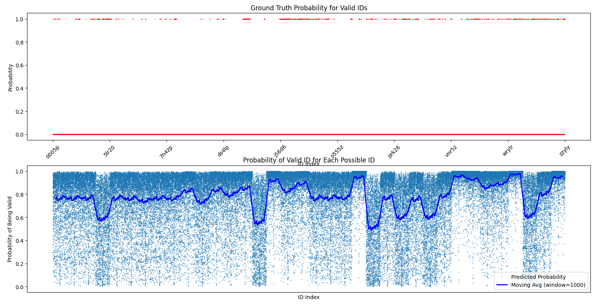

# stalcraft_item_database


This repository controls the Hugging Face dataset at:

https://huggingface.co/datasets/NotTheStallion/stalcraft-database

It holds the **maintained IDs of all items** in the game **Stalcraft**. The
database is populated by contributors: users add new IDs they discover by
running API checks against candidate IDs proposed by an AI model that
learned the probability an ID is valid. When contributors find real IDs they
commit them to this repository and the dataset on Hugging Face is updated.


## Methodology

Given the fact that Stalcraft does not provide a public list of item IDs that is updated after each game update, this repository relies AI models to predict the likelihood of an ID being valid. Contributors run these models to generate potential IDs, which are then validated through API checks. Valid IDs are added to the database, ensuring that the dataset remains current and comprehensive.

Using the API and bruteforcing was done by multiple people before, but it is very slow and time consuming. We noticed that there is a pattern to valid IDs, so we trained a simple AI model to learn those patterns and propose candidates that are much more likely to be valid, as shown in Figure bellow. This speeds up the process of finding new IDs significantly.

[Figure 1: Distribution of predicted probabilities for candidate IDs. The]



## Installation

To set up the project locally, follow these steps:
- Clone the repository:
  ```bash
  git clone REPO_URL
    ```
- Creatr .env file and add necessary environment variables (CLIENT_ID, CLIENT_SECRET) for API access.
    exmaple :
    ```env
    CLIENT_ID=your_client_id
    CLIENT_SECRET=your_client_secret
    ```
- Install the required dependencies:
  ```bash
  pip install -r requirements.txt
  ```

- Run the main script to access various functionalities:
  ```bash
  python main.py
  ```


## What this repo contains

- `data/item_id_db.csv` — the canonical CSV of item IDs and metadata
- `src/` — scripts used to build, validate and analyze IDs (classifier,
	search pipeline, API helpers, plotting, etc.)
- `main.py` — a small CLI wrapper to run the scripts in `src/`
- `test/` — pytest-based tests; in CI a test validates newly added IDs via
	the public Stalcraft API


## Contributing

There is a lot to be done in this project such as improving the AI model, improving the search pipeline, adding more metadata to the database, etc. If you are interested in contributing, please feel free to open an issue or a pull request.

To contribute, clone the repository, create a new branch, and make your changes. Once you are satisfied with your changes, submit a pull request for review.

Thank you 💕!

## License

This project is provided under the terms of the repository license.